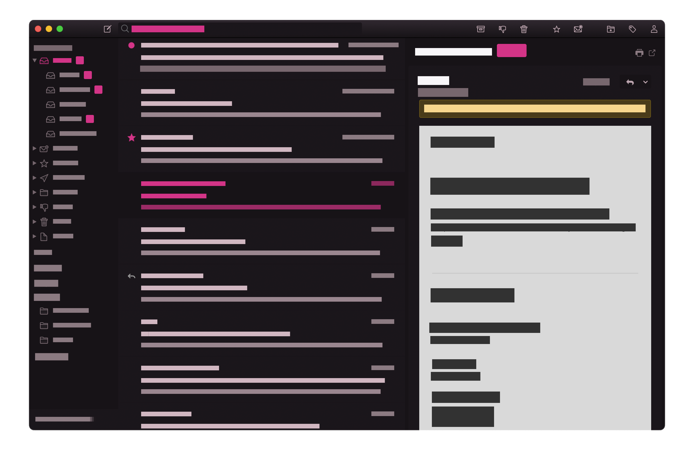

# Ponyboy (A Mailspring Theme)

Ponyboy is a dark theme for the [Mailspring](https://getmailspring.com/) email client, forked from the [Predawn](https://github.com/asparc/predawn) Mailspring theme.

# Installing

1. Download or clone the latest version of this theme from <https://github.com/lyczak/ponyboy-mailspring>.
2. Open `Mailspring > Edit > Install Theme...` and select the folder you just downloaded.
3. Done!